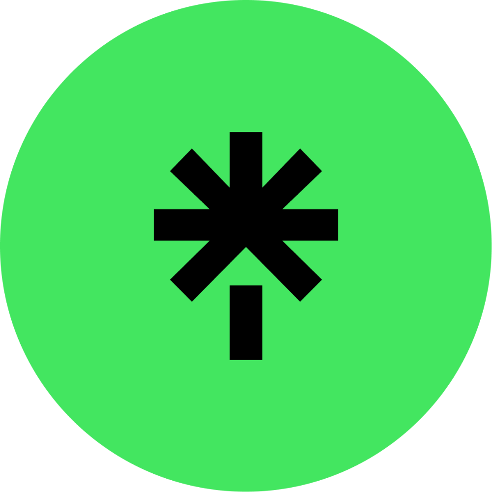

# 💫 About Me
🔭 I’m currently working on WordPress, Shopify, MERN Stack, LAMP Stack, Python, and AI integrations into SaaS applications. 👯 I’m looking to collaborate on exciting SaaS projects, AI-powered applications, and innovative web development solutions. 🤝 I’m looking for help with mastering advanced AI/ML algorithms and their integration into real-world applications. 🌱 I’m currently learning advanced data science, machine learning, and natural language processing (NLP) techniques. 💬 Ask me about full-stack development, WordPress customizations, Shopify apps, AI in SaaS, and scalable backend solutions. ⚡ Fun fact: I love solving complex coding challenges and can spend hours debugging because I find it oddly satisfying!

## 🌐 Socials

       

# 💻 Tech Stack

## Languages

        

## Hosting/SaaS

          

## Frameworks, Platforms & Libraries

### Frontend Frameworks & Libraries

        

### Backend Frameworks & Libraries

        

### Fullstack Frameworks

 

### CMS

  

### Server-Side Runtime

  

### CSS Frameworks & Preprocessors

    

### Build Tools

   

### Visualization/Graphics

## Servers

  

## Databases / ORM

        

## Design

         

## AI / ML

    

## CI/CD VCS

        

## Other

          

# 📊 GitHub Stats:
 
 

## 🏆 GitHub Trophies

### ✍️ Random Dev Quote

### 🔝 Top Contributed Repo

---

<!-- Proudly created with GPRM ( https://gprm.itsvg.in ) -->
